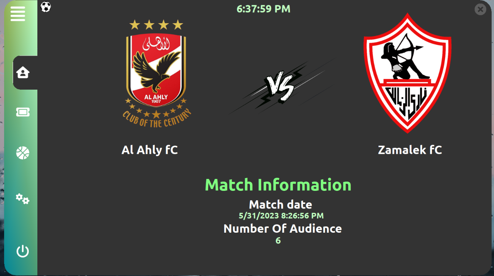
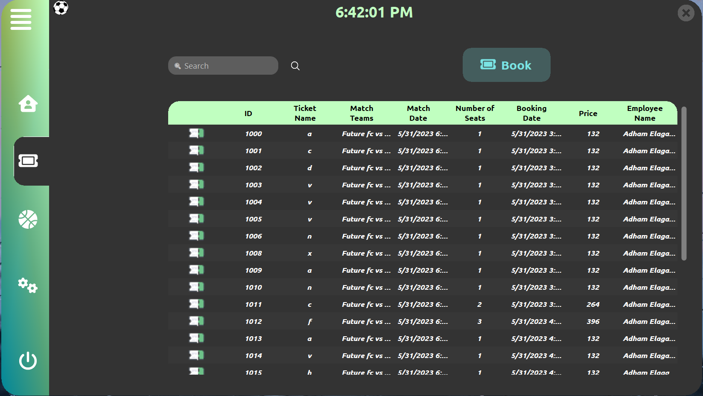
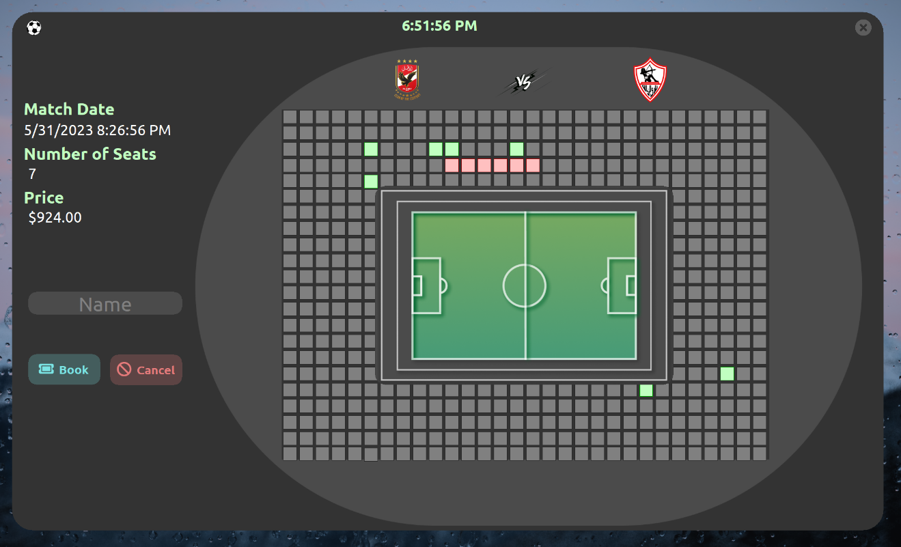
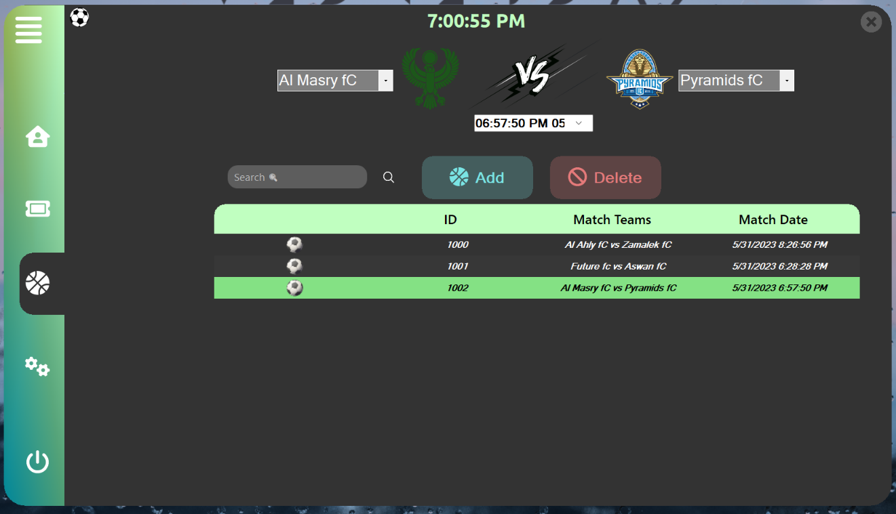
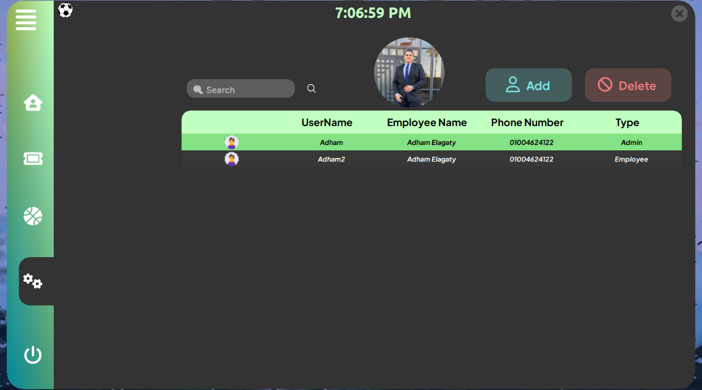
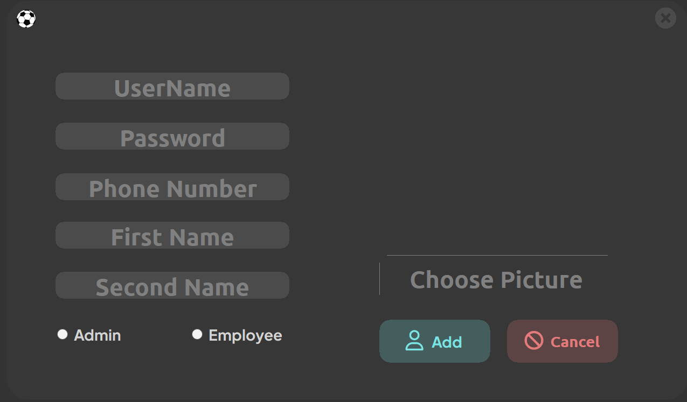
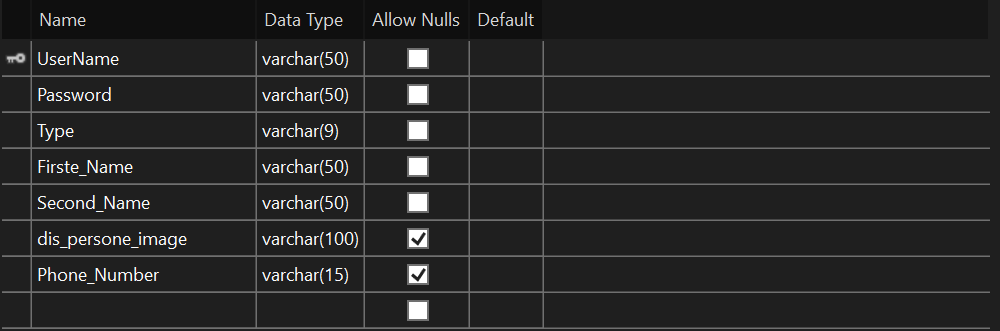
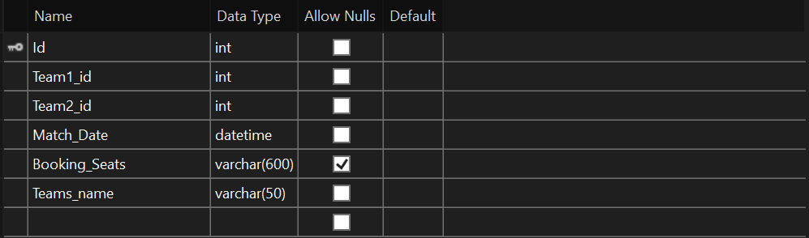
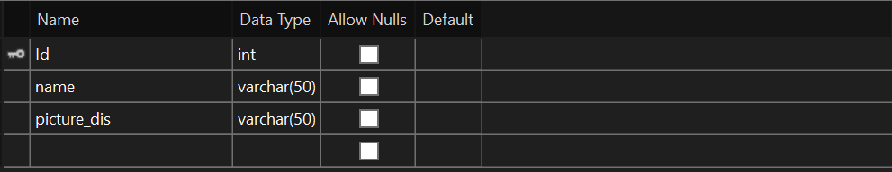
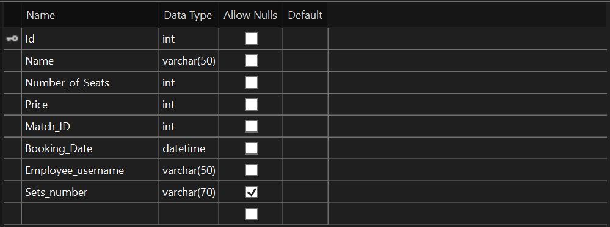

>  style="width:3.16667in;height:3.16667in" />

**Stadium Booking system**

**I make an Application to book tickets for football matches.** **This
application is used by the manager and employees. The manager has enough
powers in that he can reserve his ticket or cancel the reservation.
Also, the manager can add matches to the application and delete
matches.** **You can also see the number of tickets reserved,
information about the customer who reserved this seat and the worker who
reserved this seat.**

**The employee has a number of powers in this application, such as
reserving a seat ticket to the customer, and he can see the reserved
seats, and he can also see the current matches.**

**The application is divided into several forms:**

**1: The initial form is a loading screen.**

**2: The second form is the login screen for the manager and
employees.**

**3 :- The third form is the original application screen that contains
several forms and is divided into four pages (home ,
tiket,matchs,manage(account)); manager has more access than employee .**

**4: The manager’s form consists of:**

**\#Form Home :- which contains information that the next match is like
the name of the first team, the name of the second team, the time of the
match, and the date of the match.**

**\#Ticket form: - which contains information about tickets available
for matches and the number of customers who booked tickets.**

**\#Form Matches: - which contains information about the upcoming
matches, the dates of these matches, and the date of the matches.**

**\#Manage form: This form is only available to
the manager show available accounts on the system ,add and delete
accounts.**

**\# There is also a button in the main form for logging out of the
page.**

**5: The main form for employees is divided into:**

**\#Form Home :- which contains information that the next match is like
the name of the first team, the name of the second team, the time of the
match, and the date of the match.**

**\#Ticket form: - which contains information about tickets available
for matches and the number of customers who booked tickets.**

**\#Form Matches: - which contains information about the upcoming
matches, the dates of these matches, and the date of the matches.**

**\# There is also a button in the main form for logging out of the
page.**

**“libraries”**

**using FontAwesome.Sharp;**

**using System;**

**using System.Collections.Generic;**

**using System.ComponentModel;**

**using System.Data;**

**using System.Drawing;**

**using System.Linq;**

**using System.Text;**

**using System.Threading.Tasks;**

**using System.Windows.Forms;**

**using System.IO;**

**using System.Runtime.InteropServices;**

**using System.Data.SqlClient;**

**“form loding”**

**1. The class has a private integer variable called "counter"
initialized to 0.**

**2. The class constructor, "Form_Loding," is defined. It calls the
"InitializeComponent" method, which is typically auto-generated in
Windows Forms applications.**

**3. The method "timer_load_form_Tick" is an event handler for a timer
control called "timer_load_form." This method is executed each time the
timer ticks (based on the timer's interval). It handles the loading
animation and transition to the login form.**

**- If the counter is less than 101, it updates the value of a control
named "bunifuCircleProgress1" to reflect the current counter value. This
control could be a circular progress bar or similar element.**

**- The counter is incremented.**

**- If the counter is between 101 and 104 (inclusive), it increments the
counter and returns.**

**- If the counter exceeds 104, it disables the timer, hides the current
form (Form_Loding), and creates a new instance of "Form_login"
(presumably the login form). Finally, it displays the login form using
the "ShowDialog" method, which shows the form as a modal dialog.**

**4. The method "timer_motion_Tick" is another event handler for a timer
control called "timer_motion." This method is executed when the timer
ticks, and it handles motion for a panel named "panel_picture."**

**- It moves the panel towards the left by 5 pixels (decreasing the
X-coordinate) and keeps the Y-coordinate unchanged.**

**- If the new X-coordinate is greater than 12, it updates the panel's
location with the new coordinates.**

**- If the new X-coordinate is not greater than 12, it disables the
timer.**

**5. The "Form_Loding_Load" method is the event handler for the form's
load event. Currently, it doesn't contain any code, so it doesn't
perform any specific actions when the form is loaded.**

**Overall, this code combines two timer-based event handlers to create a
loading animation and transition effect. The "timer_load_form" controls
the progress of the loading animation and triggers the login form's
display once the animation is completed. The "timer_motion" controls the
motion of a panel on the form.**

**“ form login ”**

**1. The code belongs to the namespace \`Stadium_Booking_Systerm\`.**

**2. The \`Form_login\` class is defined and it inherits from the
\`Form\` class provided by Windows Forms.**

**3. The class includes a static \`Instance\` variable of type
\`Form_login\` and a public \`username\` variable of type string.**

**4. The constructor \`Form_login()\` initializes the form by calling
\`InitializeComponent()\` and assigns the current instance to the
\`Instance\` variable.**

**5. The \`pictureBox3_Click\` event handler is called when the user
clicks on the associated picture box. It exits the application.**

**6. The \`TexteBox_Enter\` method is a helper method that is called
when a text box gains focus. It clears the text box, changes the text
color to light gray, and sets the tab stop property of the text boxes to
true.**

**7. The \`textpass_Enter\` event handler is called when the password
text box gains focus. If the text box contains the placeholder text
"Password", it clears the error label, aligns the text to the left, and
calls \`TexteBox_Enter\` method to handle the text box focus.**

**8. The \`textname_Enter\` event handler is called when the username
text box gains focus. If the text box contains the placeholder text
"UserName", it clears the error label and calls \`TexteBox_Enter\`
method to handle the text box focus.**

**9. The \`textname_Leave\` event handler is called when the username
text box loses focus. If the text box is empty, it sets the placeholder
text "UserName" and changes the text color to IndianRed. It also
displays an error message in the label indicating that a username is
required.**

**10. The \`textpass_Leave\` event handler is called when the password
text box loses focus. If the text box is empty, it sets the placeholder
text "Password", aligns the text to the center, changes the text color
to IndianRed, and displays an error message in the label indicating that
a password is required. If the text box contains any other text, it
hides the password characters by setting the \`PasswordChar\` property
to '\0' (null character).**

**11. The \`textpass_TextAlignChanged\` event handler is called when the
text alignment of the password text box is changed. If the text is
aligned to the center, it sets the focus to the login button.**

**12. The \`btnlogin_Click\` event handler is called when the login
button is clicked. It checks if both the username and password fields
have been filled in. If they are not placeholder values, it creates an
instance of the \`Account\` class, sets the username and password, and
checks the login credentials using the \`login_Check\` method. If the
login is successful, it stores the username in the \`username\` variable
and checks if the account type is "Admin" or "Employee". If it is, it
creates an instance of the \`Form_Admin\` form, sets the username, hides
the current login form, displays the admin form, and closes the login
form. Otherwise, it displays an error message in the label indicating
that the username or password is incorrect.**

**13. The \`show_pass_btn_Click\` event handler is called when the show
password button is clicked. It hides the show password button, shows the
hide password button, and sets the \`PasswordChar\` property of the
password text box to '\*'.**

**14. The \`Enter_Key\` method is a helper method that is called when
the user presses the Enter key. It checks if the pressed key is the
Enter key and if so, it triggers the click event of the login button.**

**15. The \`hide_pass_btn_Click\` event handler**

**is called when the hide password button is clicked. It hides the hide
password button, shows the show password button, and sets the
\`PasswordChar\` property of the password text box to '\0' (null
character) to display the password in clear text.**

**16. The remaining event handlers are related to the exit button. They
handle the hover and click events of the exit button and exit the
application when clicked.**

**“main form”**

**1. The code defines a class \`Main_Form\` that extends the \`Form\`
class provided by Windows Forms.**

**2. The class includes a private integer variable \`count_close_t\` and
a static \`Instance\` variable of type \`Main_Form\`. It also declares
an instance of the \`Account\` class and a public \`username\` variable
of type string.**

**3. The constructor \`Main_Form()\` initializes the form by calling
\`InitializeComponent()\` and assigns the current instance to the
\`Instance\` variable.**

**4. The \`set_username\` method is used to set the \`username\`
property of the form.**

**5. The \`btn_page_Click\` method is a helper method that handles the
click event for navigation buttons. It iterates over the controls in
\`Panel_slider\` and updates the background color and mouse-over
background color of the buttons accordingly.**

**6. The \`iconButton2_Click\` method is an event handler for a button
click. It doesn't have any code inside.**

**7. The \`iconButton5_MouseHover\` event handler is called when the
mouse hovers over \`iconButton5\` (presumably a button). It changes the
icon color to a dark gray color.**

**8. The \`iconButton5_MouseLeave\` event handler is called when the
mouse leaves \`iconButton5\`. It changes the icon color back to white.**

**9. The \`btn_slider_Click\` event handler is called when the slider
button is clicked. It checks the width of \`Panel_slider\` and toggles
its size between 113 and 323 by starting the corresponding timer and
changing the icon character.**

**10. The \`timer_slider_hide_Tick\` event handler is called
periodically when the hide timer is active. It reduces the width of
\`Panel_slider\` until it reaches the minimum width of 113 pixels.**

**11. The \`timer_slider_show_Tick\` event handler is called
periodically when the show timer is active. It increases the width of
\`Panel_slider\` until it reaches the maximum width of 323 pixels.**

**12. The \`btn_logout_Click\` event handler is called when the logout
button is clicked. It closes the current form and opens a new instance
of \`Form_login\`.**

**13. The \`btn_logout_MouseHover\` event handler is called when the
mouse hovers over the logout button. It changes the text and icon color
to an Indian Red color.**

**14. The \`btn_logout_MouseLeave\` event handler is called when the
mouse leaves the logout button. It changes the text and icon color back
to white.**

**15. The \`loadform\` method replaces the content of \`mainpanel\` with
the specified form. It removes the previous control, sets the new form
as a top-level control, docks it to fill the parent container, and
displays it. It also sets the username for specific forms (\`Tickets\`
and \`Match\`) using their respective methods.**

**16. The \`btn_home_Click\` event handler is called when the home
button is clicked. It calls the \`btn_page_Click\` method and loads the
\`Home\` form.**

**17. The \`Form_Admin_Load\` event handler is called when the form is
loaded. It triggers the \`btn_home_Click\` event, sets the current time
in a label, retrieves employee information from the \`Account\`
instance, sets the image in a picture box, sets the employee name in a
button, and conditionally hides the \`btnmanage\` button based on the
account type.**

**18. The \`btn_ticket_Click\` event handler is called when the ticket
button is clicked. It calls the \`btn_page_Click\` method and loads the
\`Tickets\` form.**

**19. The \`btn_matche_Click\` event handler is called when the match
button is clicked. It calls the \`btn_page_Click\` method and loads**

**the \`Match\` form.**

**20. The \`btnmanage_Click\` event handler is called when the manage
button is clicked. It calls the \`btn_page_Click\` method and loads the
\`Manage\` form.**

**21. The \`timer_mytime_Tick\` event handler is called periodically and
updates the label text with the current time.**

**22. The remaining event handlers handle the hover and click events of
the exit button. They change the visibility and color of the exit
button.**

**“ form home ”**

**1. The code defines a class \`Home\` that extends the \`Form\` class
provided by Windows Forms.**

**2. The constructor \`Home()\` initializes the form by calling
\`InitializeComponent()\`.**

**3. The \`Home_Load\` event handler is called when the form is loaded.
Inside this method, an instance of the \`Mange_Matche\` class is
created.**

**4. If the \`get_next_match\` method of the \`Mange_Matche\` instance
returns \`true\`, it means there is a next match available. In this
case, it sets the visibility of \`panel_home_sorr\` to \`true\` and
proceeds to populate various controls with match information.**

**5. It loads images for the team logos from file paths stored in
\`m.Team1_pic_dis\` and \`m.Team2_pic_dis\` and assigns them to
\`pictureBox3\` and \`pictureBox2\`, respectively.**

**6. It sets the text of \`label9\` and \`label2\` to the names of the
first and second teams, respectively, retrieved from
\`m.First_team_name\` and \`m.Second_team_name\`.**

**7. It sets the text of \`label7\` to the match date and time,
retrieved from \`m.Match_date_time.ToString()\`.**

**8. It sets the text of \`label8\` to the number of audience members,
retrieved from \`m.Number_of_audience.ToString()\`.**

**9. If the \`get_next_match\` method returns \`false\`, indicating no
next match, it hides \`panel_home\`.**

**“ form tikets ”**

**1. The code defines a class \`Tickets\` that extends the \`Form\`
class provided by Windows Forms.**

**2. The class has a static field \`Instance\` of type \`Tickets\`,
which can be used to access the instance of the \`Tickets\` form.**

**3. It declares an \`Account\` object and a \`username\` string
variable.**

**4. The class has an integer variable \`x\`, used to store the ID of
the selected ticket.**

**5. The constructor \`Tickets()\` initializes the form by calling
\`InitializeComponent()\` and sets the \`Instance\` field to refer to
the current instance of the form.**

**6. The \`set_username\` method sets the value of the \`username\`
field.**

**7. The \`Refresh_Data\` method is responsible for populating the data
grid view (\`dataGridView1\`) with ticket information. It first clears
the grid view, creates a new instance of the \`Ticket\` class, retrieves
ticket data from the database using the \`view_All_ticket\` method, and
adds the data to the grid view's rows.**

**8. The \`Clear_data_gride_view\` method clears the data source of the
data grid view and removes all rows.**

**9. The \`Tickets_Load\` event handler is called when the form is
loaded. It calls \`Refresh_Data\` to populate the data grid view and
retrieves employee information using the \`set_UserName\` and
\`get_Employee_info\` methods of the \`account\` object.**

**10. The \`dataGridView1_RowsAdded\` event handler is called when rows
are added to the data grid view. It adjusts the maximum value of the
vertical scroll bar (\`bunifuVScrollBar1\`) and toggles its visibility
based on the number of rows in the grid view.**

**11. The \`bunifuVScrollBar1_Scroll\` event handler is called when the
vertical scroll bar is scrolled. It scrolls the data grid view to the
corresponding row index.**

**12. The \`iconButton1_Click\` event handler is called when
\`iconButton1\` is clicked. It opens the \`Stad_seat_Book\` form, sets
the username, clears the data grid view, and refreshes the data
afterward.**

**13. The \`bunifuImageButton1_Click\` event handler is called when
\`bunifuImageButton1\` is clicked. It performs a search based on the ID
entered in \`bunifuTextBox1\`. If the ID is valid, it retrieves the
ticket data using the \`search_by_id\` method of the \`Ticket\` class
and populates the data grid view accordingly. If no ID is entered, it
calls \`Refresh_Data\` to display all tickets.**

**14. The \`iconButton2_Click\` event handler is called when
\`iconButton2\` is clicked. If the user is not an employee, it retrieves
the ID of the selected ticket (\`x\`) and deletes the corresponding
ticket using the \`Delete\` method of the \`Ticket\` class. It then
refreshes the data grid view and hides \`iconButton2\`.**

**15. The \`bunifuTextBox1_Enter\` event handler is called when
\`bunifuTextBox1\` gains focus. It clears the error label.**

**16. The \`dataGridView1_RowHeaderMouseClick\` event handler is called
when a row header in the data grid view is clicked. It clears the
selection and hides \`iconButton2\`.**

**17. The \`dataGridView1_CellDoubleClick\` event handler is called when
a cell in the data grid view is double-clicked. If the user is not an
employee, it shows \`iconButton2\` and stores the ID of the selected
ticket in \`x\`.**

**18. The \`dataGridView1_CellMouseClick\` event handler is called when
a cell in the data grid view is clicked. It clears the selection and
hides \`iconButton2\`.**

**“ stad seats Book ”**

**1. The class definition starts with the declaration of a \`public
partial class Stad_seat_Book : Form\`. This means that the class
\`Stad_seat_Book\` inherits from the \`Form\` class and is a partial
class, indicating that its definition is split across multiple files.**

**2. Inside the class, several private fields and objects are declared,
including:**

**- \`Instance\`: a static field of type \`Stad_seat_Book\`, used to
store a reference to the current instance of the form.**

**- \`account\`: an instance of the \`Account\` class.**

**- \`mange_Matche\`: an instance of the \`Mange_Matche\` class.**

**- \`ticket\`: an instance of the \`Ticket\` class.**

**- \`x\`: a private string variable used for storing seat numbers.**

**- \`num_of_seats\`: an integer variable to keep track of the number of
seats selected.**

**- \`price\`: an integer variable representing the price of a single
ticket.**

**- \`Ticket_price\`: an integer variable to store the total price of
the selected seats.**

**- \`username\`: a public string variable to store the username of the
current user.**

**3. The constructor \`Stad_seat_Book()\` initializes the form and sets
the \`Instance\` field to refer to the current instance of the form.**

**4. The \`set_username(string username)\` method is used to set the
value of the \`username\` variable.**

**5. The \`Stad_seat_Book_Load\` event handler is executed when the form
is loaded. It performs various initialization tasks such as setting the
current time, retrieving employee information, retrieving the next match
details, displaying team images, setting seat availability, etc.**

**6. The \`mytime_Tick\` event handler updates the label displaying the
current time periodically.**

**7. The \`iconButton2_Click\` event handler is executed when a button
named \`iconButton2\` is clicked. It simply closes the form.**

**8. The \`iconButton1_Click\` event handler is executed when a button
named \`iconButton1\` is clicked. It performs validation checks on the
name input and number of seats selected, creates a new \`Ticket\`
object, sets its properties based on the input values, and inserts the
ticket into the system. If the ticket is successfully inserted, the form
is closed.**

**9. The \`text_name_Enter\` and \`text_name_Leave\` event handlers
handle the focus events for a text box named \`text_name\`. They change
the text color and clear error messages based on the focus state.**

**10. The \`btn_exite_dark_Click\` and \`btn_exite_light_Click\` event
handlers handle the click events for buttons named \`btn_exite_dark\`
and \`btn_exite_light\`, respectively. They close the form when
clicked.**

**11. The \`btn_exite_dark_MouseLeave\` event handler is executed when
the mouse leaves the \`btn_exite_dark\` button. It toggles the
visibility of two buttons to provide a visual effect.**

**12. The \`btn_exite_light_MouseHover\` event handler is executed when
the mouse hovers over the \`btn_exite_light\` button. It toggles the
visibility of two buttons to provide a visual effect.**

**13. The \`Enter_Key\` method is a generic event handler that handles
the KeyPress event for any control. If the Enter key is pressed, it
triggers the \`iconButton1_Click\` event handler, effectively simulating
a click on the submit button.**

**14. The \`button_Click\` event handler is executed when**

**any button on the form is clicked. It handles the selection and
deselection of seats. It changes the color of the button based on its
current state and updates the \`x\`, \`num_of_seats\`, and
\`Ticket_price\` variables accordingly. It also updates the
corresponding labels to display the updated seat count and total
price.**

**“ matchs form ”**

**1. The class has a \`public static Match Instance\` field, which is
used to store a reference to the current instance of the form.**

**2. The class contains an instance of the \`Account\` class, named
\`account\`, and a private string variable named \`UserName\`.**

**3. The constructor \`Match()\` initializes the form by calling
\`InitializeComponent()\` and sets the \`Instance\` field to refer to
the current instance of the form.**

**4. The \`set_user_name(string name)\` method is used to set the value
of the \`UserName\` variable.**

**5. The \`Refresh_Data()\` method clears the data in the DataGridView
and retrieves ticket information from the database using the
\`Mange_Matche\` class. It populates the DataGridView with the ticket
details and updates the scrollbar accordingly.**

**6. The \`Clear_data_gride_view()\` method clears all the rows in the
DataGridView.**

**7. The event handler \`dataGridView1_RowsAdded\` is executed when rows
are added to the DataGridView. It adjusts the scrollbar's maximum value
and visibility based on the number of rows.**

**8. The event handler \`dataGridView1_RowsRemoved\` is executed when
rows are removed from the DataGridView. It adjusts the scrollbar's
maximum value based on the updated number of rows.**

**9. The event handler \`bunifuVScrollBar1_Scroll\` is executed when the
vertical scrollbar is scrolled. It scrolls the DataGridView to the
corresponding row.**

**10. The event handler \`Match_Load\` is executed when the form is
loaded. It initializes the \`account\` object, retrieves team
information from the database, populates the team selection comboboxes,
and sets the custom date format for the DateTimePicker. It also checks
the user type and adjusts the visibility of form elements accordingly.
Finally, it calls \`Refresh_Data()\` to populate the DataGridView with
ticket information.**

**11. The event handler \`iconButton1_Click\` is executed when a button
named \`iconButton1\` is clicked. It retrieves the selected team names
and match date from the comboboxes and DateTimePicker, creates a new
\`Mange_Matche\` object, sets its properties, and inserts the match into
the database. After that, it calls \`Refresh_Data()\` to update the
DataGridView.**

**12. The event handler \`iconButton2_Click\` is executed when a button
named \`iconButton2\` is clicked. If the user is not an employee, it
deletes the selected match from the database using the \`Mange_Matche\`
class, clears the selection in the DataGridView, and calls
\`Refresh_Data()\`.**

**13. The event handlers \`dataGridView1_CellMouseClick\`,
\`dataGridView1_CellContentDoubleClick\`, and
\`dataGridView1_RowHeaderMouseClick\` handle mouse click events on the
DataGridView. They clear the selection and adjust the visibility of the
delete button accordingly.**

**14. The event handler \`dataGridView1_SelectionChanged\` is executed
when the selection in the DataGridView changes. If there are no selected
cells, it hides the delete button.**

**15. The method \`get_pictur\` retrieves the image of a team based on
its ID from the database and assigns it to a PictureBox control.**

**16. The event handlers \`comboBox2_SelectedIndexChanged\` and
\`comboBox1_SelectedIndexChanged\` are executed when the selected item
changes in the corresponding comboboxes. They call the \`get_pictur\`
method to update the team images based on the selected team's ID.**

**17. The event handler \`bunifuImageButton1_Click\` is executed when a
button named \`bunifuImageButton1\` is clicked. It performs a search
based on the entered ID number. If a valid**

**integer is entered, it clears the DataGridView, retrieves the matching
ticket information from the database using the \`Mange_Matche\` class,
and populates the DataGridView with the search results. If no ID is
entered, it calls \`Refresh_Data()\` to show all tickets.**

**18. The event handler \`bunifuTextBox1_Enter\` is executed when the
text box named \`bunifuTextBox1\` gains focus. It clears the error
label.**

**“manage account (access by admin)”**

**1. The class has a private string variable named \`x\`.**

**2. The constructor \`Mange()\` initializes the form by calling
\`InitializeComponent()\`.**

**3. The \`Refresh_Data()\` method clears the data in the DataGridView,
retrieves account information from the database using the \`Account\`
class, and populates the DataGridView with the account details. It also
clears the selection in the DataGridView and hides the pictureBox1.**

**4. The \`Clear_data_gride_view()\` method clears all the rows in the
DataGridView and adds empty rows.**

**5. The event handler \`dataGridView1_RowsAdded\` is executed when rows
are added to the DataGridView. It adjusts the maximum value and
visibility of the bunifuVScrollBar based on the number of rows.**

**6. The event handler \`bunifuVScrollBar1_Scroll\` is executed when the
vertical scrollbar is scrolled. It scrolls the DataGridView to the
corresponding row.**

**7. The event handler \`Mange_Load\` is executed when the form is
loaded. It calls \`Refresh_Data()\` to populate the DataGridView with
account information.**

**8. The event handler \`dataGridView1_SelectionChanged\` is executed
when the selection in the DataGridView changes. If there are no selected
cells, it hides the iconButton2.**

**9. The event handlers \`dataGridView1_RowHeaderMouseClick\` and
\`dataGridView1_CellMouseClick\` handle mouse click events on the
DataGridView. They clear the selection and hide the iconButton2.**

**10. The event handler \`bunifuImageButton1_Click\` is executed when a
button named \`bunifuImageButton1\` is clicked. It clears the
DataGridView, the pictureBox1 image, and performs a search based on the
entered ID number. If a valid ID is entered, it retrieves the matching
account information from the database using the \`Account\` class and
populates the DataGridView with the search results. It also displays the
corresponding person's image in the pictureBox1.**

**11. The event handler \`iconButton1_Click\` is executed when a button
named \`iconButton1\` is clicked. It creates a new instance of the
\`Add_account\` form and displays it as a dialog. After that, it calls
\`Refresh_Data()\` to update the DataGridView.**

**12. The event handler \`iconButton2_Click\` is executed when a button
named \`iconButton2\` is clicked. It deletes the selected account from
the database using the \`Account\` class, calls \`Refresh_Data()\` to
update the DataGridView, and hides the iconButton2.**

**13. The event handler \`dataGridView1_CellDoubleClick\` is executed
when a cell in the DataGridView is double-clicked. It retrieves the
value of the "User_name" cell from the clicked row, shows the
iconButton2, and sets the \`x\` variable to the user name value. It also
retrieves the employee information and displays the corresponding
person's image in the pictureBox1.**

**“ add account ”**

**1. The constructor \`Add_account()\` initializes the form by calling
\`InitializeComponent()\`.**

**2. The method \`TexteBox_Enter(ref TextBox t)\` is a helper method
that is used to handle the enter event for TextBox controls. It clears
the text, sets the text color to LightGray, and enables the tab stop for
the TextBox.**

**3. The event handler \`textpass_Enter\` is executed when the password
TextBox (\`textpass\`) receives focus. If the current text is
"Password", it clears the text, sets the alignment to Left, calls
\`TexteBox_Enter\` to handle the enter event, and sets the PasswordChar
property to '\*' to mask the password.**

**4. The event handler \`textname_Enter\` is executed when the username
TextBox (\`textname\`) receives focus. If the current text is
"UserName", it clears the text and calls \`TexteBox_Enter\` to handle
the enter event.**

**5. The event handler \`textname_Leave\` is executed when the username
TextBox loses focus. If the current text is empty, it sets the text to
"UserName", changes the text color to IndianRed, and displays an error
message in the \`lab_username_err\` label.**

**6. The event handler \`textpass_Leave\` is executed when the password
TextBox loses focus. If the current text is empty, it sets the alignment
to Center, removes the password masking, sets the text color to
IndianRed, sets the text to "Password", and displays an error message in
the \`lab_pass_err\` label. If the text is not "Password", it sets the
password masking back to '\*' character.**

**7. The event handler \`textpass_TextAlignChanged\` is executed when
the alignment of the password TextBox changes. If the alignment is set
to Center, it moves the focus to the \`textphonenumber\` TextBox.**

**8. The event handlers \`textphonenumber_Leave\` and
\`textphonenumber_Enter\` handle the focus events for the phone number
TextBox (\`textphonenumber\`). They clear the default text when entering
and restore it if it is empty when leaving.**

**9. The event handler \`iconButton1_Click\` is executed when a button
named \`iconButton1\` is clicked. It checks if all the required fields
(username, password, first name, second name, and type) are filled. If
so, it creates an instance of the \`Account\` class, sets the account
details using the provided values, calls the \`creat_acconut()\` method
to create the account in the database, and saves the person's image if
it exists. Finally, it closes the form. If any required field is
missing, it displays an error message in the corresponding label.**

**10. The event handler \`iconButton2_Click\` is executed when a button
named \`iconButton2\` is clicked. It simply closes the form.**

**11. The event handlers \`textsname_Enter\` and \`textfname_Enter\`
handle the focus events for the first name TextBox (\`textfname\`) and
the second name TextBox (\`textsname\`). They clear the default text
when entering.**

**12. The event handler \`btnchoosepic_Click\` is executed when a button
named \`btnchoosepic\` is clicked. It opens a file dialog to choose an
image file (jpg, png, or bmp), and if a file is selected, it sets the
image in the \`pictureBox1\`.**

**13. The event handlers \`textfname_Leave\` and \`textsname_Leave\` are
executed when the first name and second name TextBoxes lose focus,
respectively. If the current text is empty, they**

**restore the default text, change the text color to IndianRed, and
display an error message in the corresponding label.**

**14. The event handlers \`btn_exite_dark_Click\`,
\`btn_exite_light_Click\`, \`btn_exite_dark_MouseLeave\`, and
\`btn_exite_light_MouseEnter\` handle the click and mouse enter/leave
events for exit buttons (\`btn_exite_dark\` and \`btn_exite_light\`).
They close the form or change the visibility of the buttons based on the
mouse interaction.**

**15. The event handlers \`radio_Admin_CheckedChanged\` and
\`radio_Employee_CheckedChanged\` handle the checked changed events for
radio buttons (\`radio_Admin\` and \`radio_Employee\`). They clear the
error message in the \`lab_type_error\` label when a type is selected.**

**====================================================**

**“ Stadium DataBase ”**

**This database tables using SQL statements. The tables are named
\`Account\`, \`Matches\`, \`Teams\`, and \`Ticket\`. Let's explain each
table and its columns:**

**1. Table \`Account\`:**

**- Columns:**

**- \`UserName\`: VARCHAR(50) - Represents the username of the account
(unique and not null).**

**- \`Password\`: VARCHAR(50) - Represents the password of the account
(not null).**

**- \`Type\`: VARCHAR(9) - Represents the type of the account (e.g.,
"Admin" or "Employee") (not null).**

**- \`Firste_Name\`: VARCHAR(50) - Represents the first name of the
person associated with the account (not null).**

**- \`Second_Name\`: VARCHAR(50) - Represents the second name of the
person associated with the account (not null).**

**- \`dis_persone_image\`: VARCHAR(100) - Represents the path or URL to
the person's image (nullable).**

**- \`Phone_Number\`: VARCHAR(15) - Represents the phone number
associated with the account (nullable).**

**- Primary Key: The primary key is defined on the \`UserName\`
column.**

**2. Table \`Matches\`:**

**- Columns:**

**- \`Id\`: INT - Represents the unique identifier for the match (not
null).**

**- \`Team1_id\`: INT - Represents the ID of the first team
participating in the match (not null).**

**- \`Team2_id\`: INT - Represents the ID of the second team
participating in the match (not null).**

**- \`Match_Date\`: DATETIME - Represents the date and time of the match
(not null).**

**- \`Booking_Seats\`: VARCHAR(600) - Represents the booked seats for
the match (nullable).**

**- \`Teams_name\`: VARCHAR(50) - Represents the name of the teams
participating in the match (not null).**

**- Primary Key: The primary key is defined on the \`Id\` column.**

**- Foreign Key Constraints: There are two foreign key constraints
referencing the \`Teams\` table, one for \`Team1_id\` and one for
\`Team2_id\`.**

**3. Table \`Teams\`:**

**- Columns:**

**- \`Id\`: INT - Represents the unique identifier for the team (not
null).**

**- \`name\`: VARCHAR(50) - Represents the name of the team (not
null).**

**- \`picture_dis\`: VARCHAR(50) - Represents the path or URL to the
team's picture (not null).**

**- Primary Key: The primary key is defined on the \`Id\` column.**

**4. Table \`Ticket\`:**

**- Columns:**

**- \`Id\`: INT - Represents the unique identifier for the ticket (not
null).**

**- \`Name\`: VARCHAR(50) - Represents the name of the ticket (not
null).**

**- \`Number_of_Seats\`: INT - Represents the number of seats booked on
the ticket (not null).**

**- \`Price\`: INT - Represents the price of the ticket (not null).**

**- \`Match_ID\`: INT - Represents the ID of the match associated with
the ticket (not null).**

**- \`Booking_Date\`: DATETIME - Represents the date and time when the
ticket was booked (not null).**

**- \`Employee_username\`: VARCHAR(50) - Represents the username of the
employee associated with the ticket (not null).**

**- \`Sets_number\`: VARCHAR(70) - Represents the seat numbers for the
ticket (nullable).**

**- Primary Key: The primary key is defined on the \`Id\` column.**

**- Foreign Key Constraints: There are two foreign key constraints, one
referencing the \`Matches\` table (\`Match_ID\`) and one referencing the
\`Account\` table (\`Employee_username\`).**

**=====================================================**

**“classes”**

**1:- account class..**

**1. Class and Constructor:**

**- The class is declared as \`internal\`, which means it can be
accessed within the same assembly.**

**- The class contains a private field \`cn\` of type \`SqlConnection\`,
which represents a connection to a SQL Server database. The connection
string is provided, specifying the database file location.**

**- The class has several private fields representing different
attributes of an account, such as \`UserName\`, \`Password\`, \`type\`,
\`first_name\`, \`second_name\`, \`phone_number\`, \`persone_image\`,
and \`FullName\`.**

**- There are multiple constructors defined, allowing different ways to
initialize the account object.**

**2. Setter and Getter Methods:**

**- The class provides setter and getter methods for each attribute,
allowing access to and modification of the account information.**

**3. Database Operations:**

**- The class includes various methods for interacting with the
database.**

**- The \`view_All_Account\` method retrieves all account records from
the database and returns them as a \`DataTable\`.**

**- The \`get_Employee_info\` method retrieves the account information
for a specific account based on the provided username.**

**- The \`login_Check\` method checks if a username and password
combination exists in the database and retrieves the corresponding
account information if found.**

**- The \`creat_acconut\` method inserts a new account record into the
database with the provided account details.**

**- The \`search_by_id\` method searches for an account based on the
provided username and returns the account information as a
\`DataTable\`.**

**- The \`Delete\` method deletes an account from the database based on
the provided username.**

**4. Exception Handling:**

**- The methods catch \`SqlException\` and display the corresponding
error message using \`MessageBox.Show()\`.**

**2:-manage match..**

**1. The class has a private SqlConnection object named \`cn\` which
establishes a connection to a local SQL Server database. The connection
string is specified with the database file path.**

**2. The class has several private member variables representing match
details such as team names, team IDs, match date and time, number of
audiences, match ID, seat information, and image display paths for the
teams.**

**3. Public properties are defined for accessing and setting the values
of these member variables.**

**4. The \`set_mange\` method takes a string as input and processes it
to set the seat availability for the match. It splits the input string
by comma and assigns the corresponding seat as occupied in the \`Seats\`
array.**

**5. The \`search_by_id\` method retrieves match information from the
database based on the provided match ID. It executes a SQL SELECT query
and returns the resulting DataTable.**

**6. The \`Check_this_chair_Avalibal\` method checks if a specific seat
is available for booking based on its index in the \`Seats\` array.**

**7. The \`Generat_Id\` method generates a new match ID by querying the
database for the highest existing ID and incrementing it. If no IDs are
found, it sets the ID to 1000.**

**8. The \`insert_match\` method inserts a new match record into the
database. It retrieves the team IDs based on the team names, generates a
new match ID, and inserts the match details into the database table.**

**9. The \`view_All_ticket\` method retrieves all match tickets from the
database. It executes a SQL SELECT query and returns the resulting
DataTable.**

**10. The \`get_next_match\` method retrieves the details of the next
upcoming match from the database. It executes a SQL SELECT query with a
filter for matches after the current date and time. It populates the
class variables with the retrieved information.**

**11. The \`Check_FK_ID_Ticket\` method checks if a given match ID is
referenced in the foreign key of the \`Ticket\` table. It executes a SQL
SELECT query and returns a boolean indicating whether the match ID
exists in the table.**

**12. The \`Delete\` method deletes a match record from the database. It
first checks if the match ID is referenced in the \`Ticket\` table, and
if so, deletes the corresponding tickets. Then, it deletes the match
record itself by executing a SQL DELETE query.**

**3:- tiket class…**

**1. The class has a private SqlConnection object named "cn" which
represents the connection to a SQL Server database.**

**2. It includes several private fields such as "id", "number_of_seats",
"match_id", "price", "name", "Employee_username", "name_of_Employee",
"set_num", and "d" (which is a DateTime object).**

**3. The class defines public properties for accessing and modifying
these private fields. Each property has a "get" and "set" accessor.**

**4. The "Generat_Id()" method is used to generate a unique ID for the
ticket. It retrieves the latest ID from the "Ticket" table in the
database and increments it by 1. If no ID exists in the table, it sets
the initial ID to 1000. The method returns a boolean value indicating
the success of the operation.**

**5. The "insert_ticket()" method is responsible for inserting a new
ticket into the database. It calls the "Generat_Id()" method to obtain a
unique ID for the ticket. Then, it constructs an SQL query to insert the
ticket details (ID, name, number of seats, price, match ID, date,
employee username, and seat number) into the "Ticket" table. After
executing the query, it also updates the "Booking_Seats" field in the
"Matches" table with the newly booked seat number. The method returns a
boolean value indicating the success of the operation.**

**6. The "view_All_ticket()" method retrieves all ticket information
from the database. It constructs an SQL query to join the "Ticket",
"Matches", and "Account" tables based on their relationships and
retrieves relevant data (ticket ID, ticket name, team names, match date,
number of seats, booking date, price, and employee name). The method
returns a DataTable object containing the retrieved data.**

**7. The "search_by_id(int sid)" method is used to search for a specific
ticket by its ID. It constructs an SQL query similar to the
"view_All_ticket()" method but adds a condition to filter the results
based on the provided ticket ID. The method returns a DataTable object
containing the retrieved data.**

**8. The "Delete(int sid)" method is responsible for deleting a ticket
from the database based on its ID. It constructs an SQL query to delete
the ticket from the "Ticket" table. The method takes the ticket ID as a
parameter.**

**====================================================**
